# KBO 8-BIT BASEBALL

패미컴 시대 야구 게임의 감각을 목표로 만든 KBO 구단 기반 야구 게임입니다.

| 모드 | 인원 | 내용 |
|---|---|---|
| **투타 대결** | 1인 | 반 이닝 3아웃. 유저는 타자만 맡는다 |
| **1경기 (9이닝)** | 1인 | 공수 교대. 유저가 **타격과 투구를 모두** 맡는다. 유저는 홈(후공) |
| **2인용 대전 (9이닝)** | 2인 | 한 명은 타격, 다른 한 명은 **투구+수비**. 반 이닝마다 역할이 바뀐다 |

```
python -m kbo_ball          # 저장소 루트에서 실행
run_kbo_ball.bat            # Windows: git pull + pygame 설치 + 실행
```

필요 패키지는 `pygame` 하나입니다. (`python -m pip install pygame`)

---

## 0. 화면

| | |
|---|---|
| 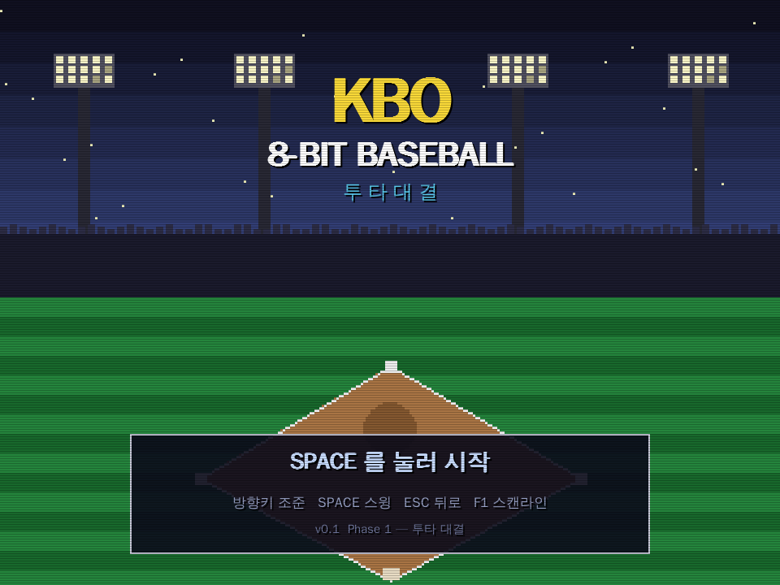 | 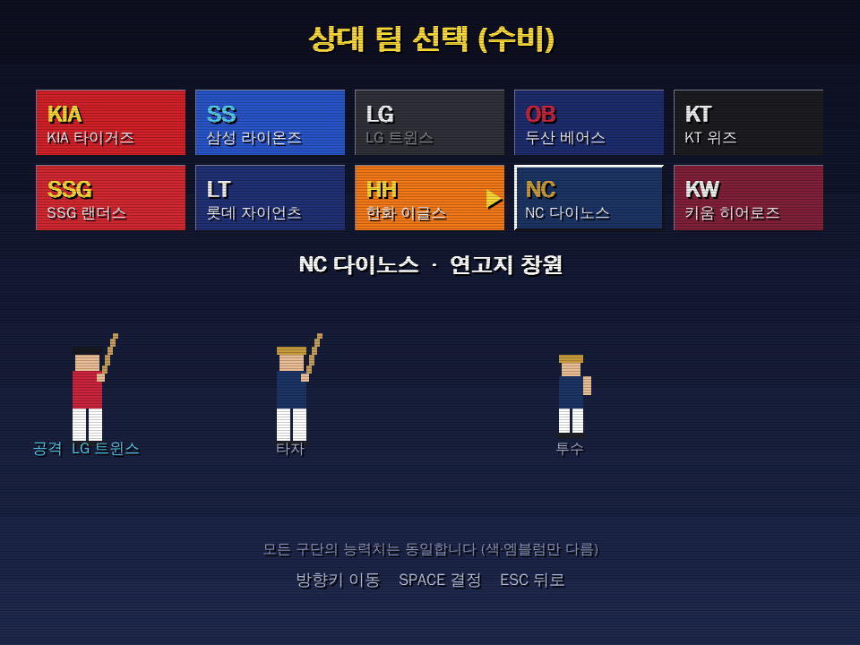 |
| 타이틀 | 구단 선택 (10개 구단) |
| 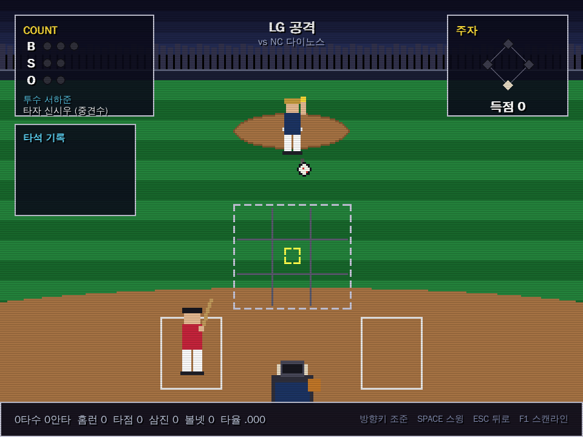 | 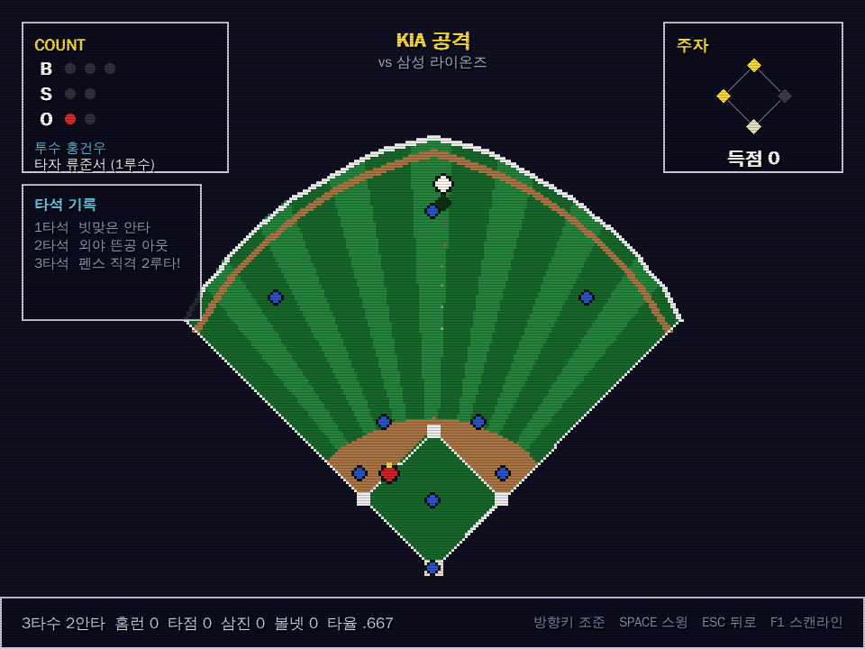 |
| 투타 대결 — 포수 뒤 시점 | 타구 중계 — 탑다운 전환 |
| 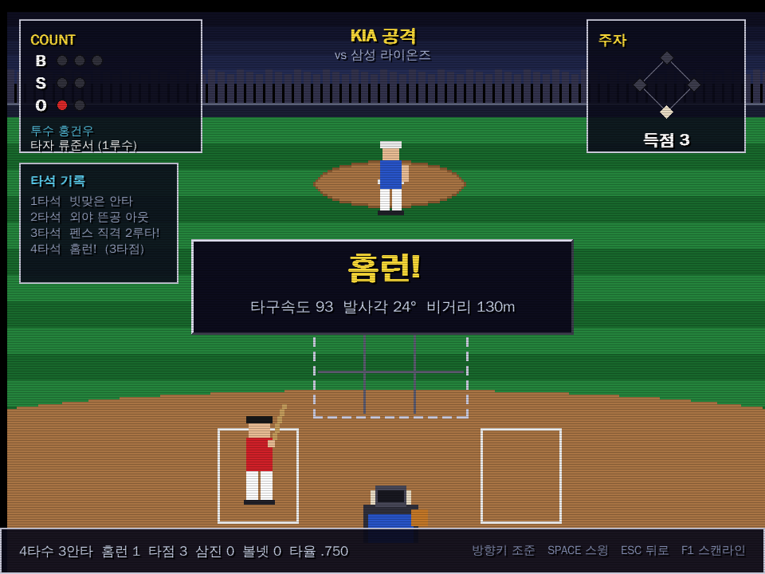 | 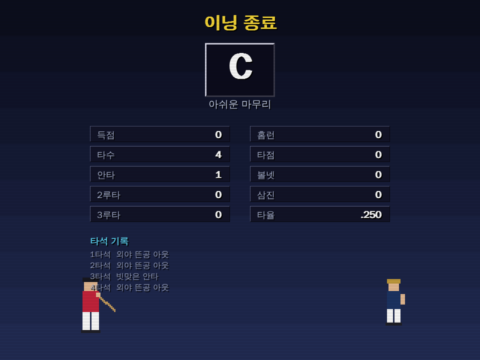 |
| 결과 배너 | 이닝 종료 · 등급 |
| 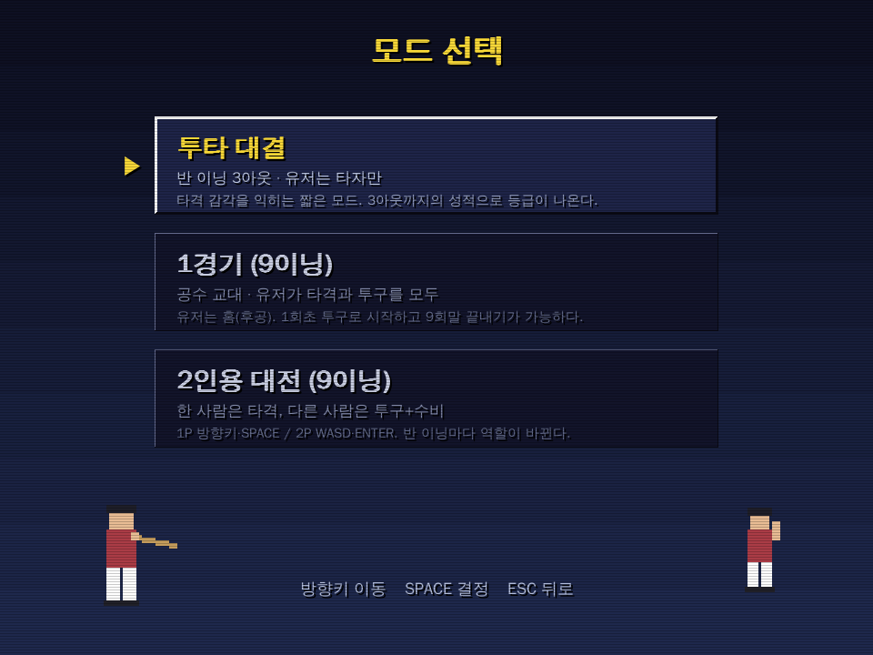 | 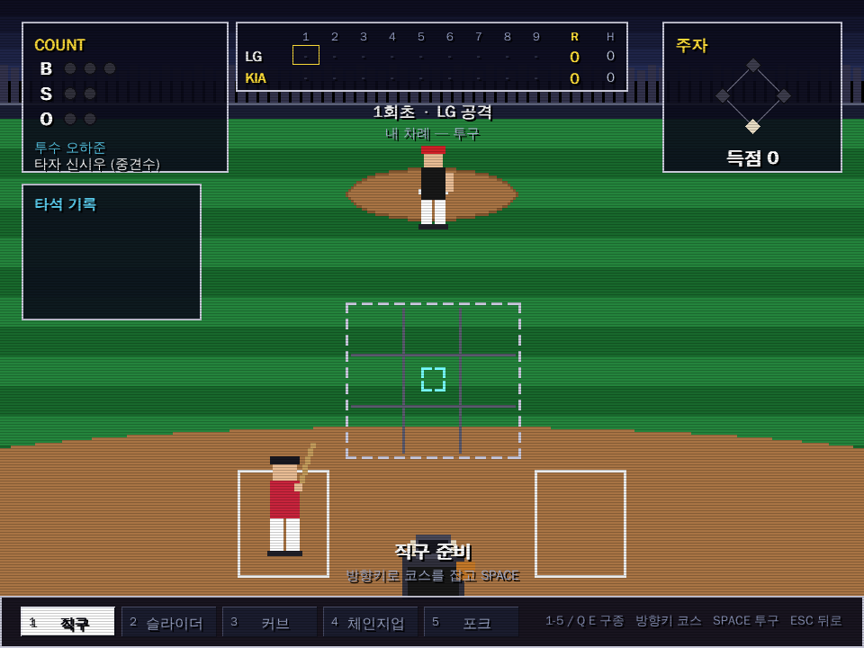 |
| 모드 선택 (1인 2종 · 2인 1종) | 유저 투구 — 구종·코스·시프트 |
| 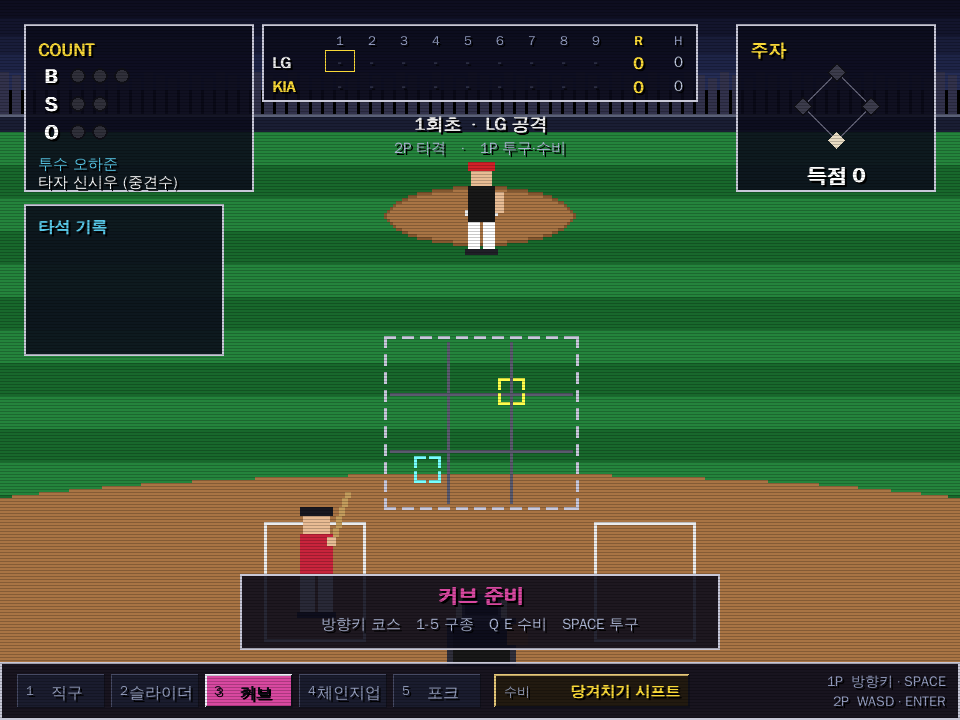 | 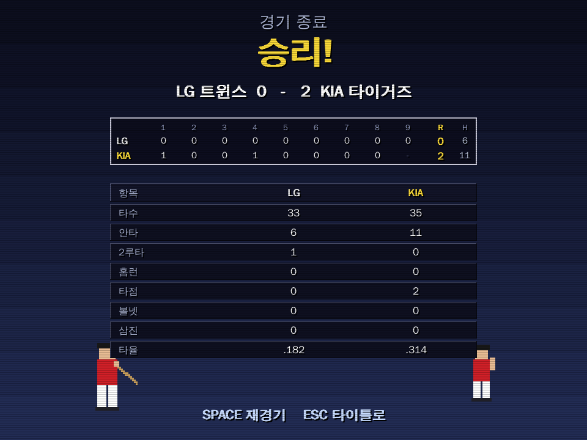 |
| 2인용 — 배트 커서(노랑) + 투구 커서(하늘) | 경기 종료 · 이닝별 전광판 |
| 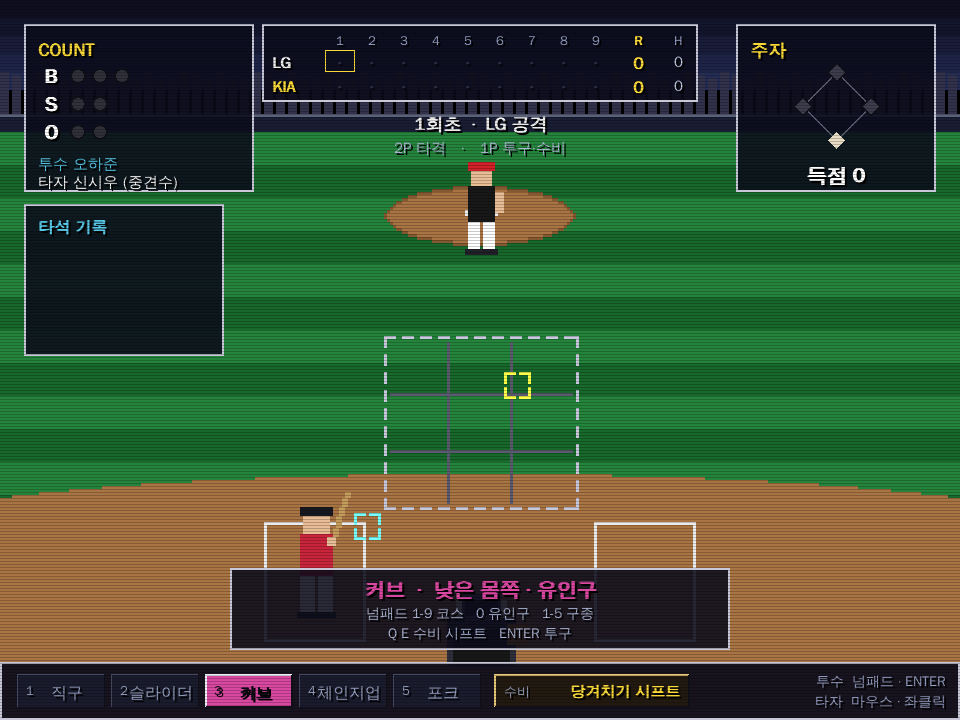 | 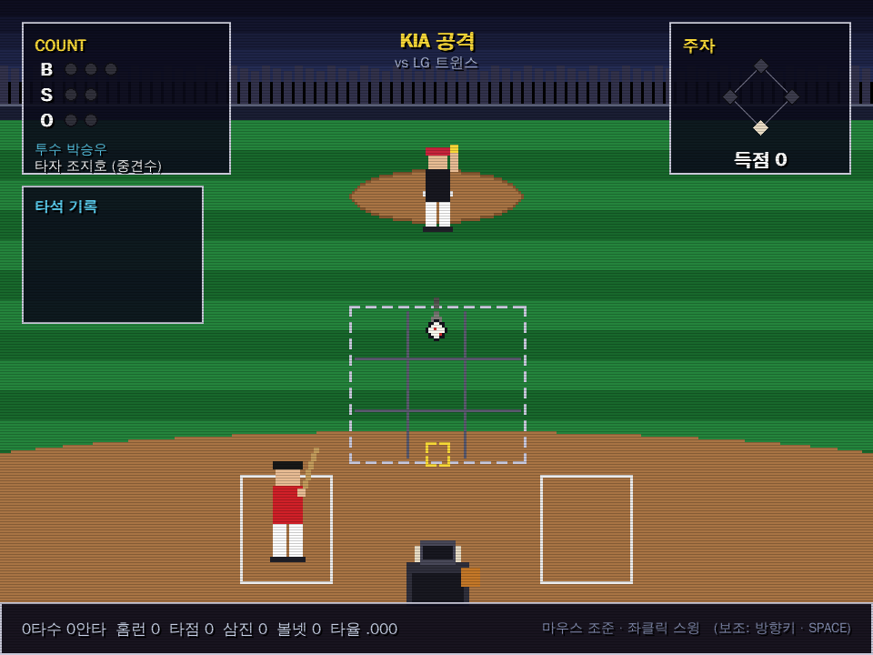 |
| 투수 — 넘패드 코스 + 유인구 + 시프트 | 타자 — 마우스 조준 |

---

## 1. 조작

**입력 장치가 역할을 따라갑니다** — 타자는 마우스, 투수는 키보드+넘패드.
2인용에서는 반 이닝마다 두 사람이 마우스와 키보드를 주고받습니다.

### 타자 — 마우스

| 조작 | 동작 |
|---|---|
| 마우스 이동 | 배트 조준 |
| **좌클릭** | 스윙 (공 하나당 한 번) |
| 방향키 · SPACE(또는 Z) | 보조 조작 — 방향키로 조준, SPACE/Z로 스윙 (마우스를 쓸 수 없을 때) |

### 투수 — 키보드 + 넘패드

**넘패드 배열이 스트라이크존 3×3과 그대로 겹칩니다.**

```
   7 8 9      높은 몸쪽 / 한복판 / 바깥쪽
   4 5 6      가운데 …
   1 2 3      낮은  …
```

| 키 | 동작 |
|---|---|
| 넘패드 **1~9** | 코스 선택 (존 3×3) |
| 넘패드 **0** (또는 넘패드 `.` · `/`) | 유인구 토글 — 같은 방향으로 존 밖을 노린다 |
| **1 ~ 5** (숫자열) | 구종 (직구·슬라이더·커브·체인지업·포크) |
| **Q · E** | 수비 시프트 변경 |
| **ENTER** | 투구 |
| U I O / J K L / M , . | 넘패드가 없는 키보드용 대체 3×3 |

던지기 직전까지 코스를 바꿀 수 있고 **투구 커서는 던지는 순간 사라지므로**,
마지막에 코스를 옮겨 타자를 속일 수 있습니다.

### 공통

| 키 | 동작 |
|---|---|
| ESC | 한 단계 뒤로 (타이틀에서는 종료) |
| F1 | CRT 스캔라인 켜기/끄기 |

---

## 2. 게임 흐름

```
타이틀 → 모드 선택 → 구단 선택(내 팀 → 상대 팀) → 경기 → 결과
```

**투타 대결** — 유저는 타자, CPU가 투수. 3아웃이 되면 성적으로 S~D 등급이 매겨집니다.

**2인용 대전** — 1P가 홈(후공), 2P가 원정(선공)입니다. 1회초에는 2P가 치고 1P가
던지며, 1회말에 역할이 뒤바뀝니다. 역할이 바뀌면 **마우스와 키보드를 바꿔 쥐면**
됩니다.

**1경기 / 2인용** — 유저(1P)는 홈(후공)이라 **1회초 투구부터** 시작합니다. 반 이닝마다 공수가
바뀌고, 전광판에 이닝별 득점이 쌓입니다. 구현한 경기 종료 규칙은 다음과 같습니다.

| 상황 | 처리 |
|---|---|
| 9회초 종료 시점에 홈팀이 앞섬 | **9회말을 하지 않고** 경기 종료 |
| 9회말(연장 말 포함) 도중 홈팀이 역전 | **끝내기**로 즉시 종료 |
| 정규 9회 후 동점 | 연장 진행 (최대 12회) |
| 12회까지 동점 | **무승부** |

---

## 3. 타격 시스템

스윙 판정은 **세 축을 따로 재고 역할을 나눠** 합칩니다.

| 축 | 의미 | 주로 결정하는 것 |
|---|---|---|
| `q_time` | 스윙 입력(좌클릭 또는 SPACE·Z) 시점과 홈플레이트 도달(t=1.0)의 프레임 차 | 타구 속도 |
| `q_dx` | 커서와 공의 **좌우** 오차 | 타구 속도 |
| `q_dy` | 커서와 공의 **상하** 오차 | **발사각** (속도에는 완만하게만 영향) |

> **왜 상하 오차를 속도 계산에서 떼어냈나**
> `dy`가 속도까지 지배하면 "뜬공을 만들려면 반드시 빗맞혀야" 하므로
> 홈런이 구조적으로 나올 수 없습니다. 그래서 `dy`는 발사각을 정하고,
> 속도에는 약한 감쇠(`0.82 + 0.18·q_dy`)만 줍니다.
> 덕분에 **공 밑을 살짝 퍼올린 정타 = 담장 밖**이라는 인과가 성립합니다.

타구 방향은 타이밍에서 나옵니다. **빠르면 당겨치고, 늦으면 밀어칩니다.**
아주 빠르거나 아주 늦으면 파울입니다.

비거리는 진공 포물선의 `sin(2θ)`(45도 최대) 대신 **28도에서 최대가 되는 종
모양 곡선**을 씁니다. 공기저항·백스핀이 있는 실제 타구의 최적 발사각에 맞춘
것입니다.

### 밸런스 검증 결과

조준 정확도를 달리한 봇으로 각 4,000 스윙을 시뮬레이션한 값입니다.

| 플레이 수준 | 타율 | 홈런율 | 헛스윙률 | 비거리 중앙값 |
|---|---|---|---|---|
| 초보 (조준 SD 6px, 타이밍 SD 4프레임) | .213 | .001 | 21.8% | 54m |
| 중급 (3.5px / 2.5프레임) | .382 | .001 | 1.5% | 57m |
| 고수 · 라인드라이브 노림 (2px / 1.5프레임) | .520 | .002 | 0.0% | 59m |
| 고수 · 어퍼컷 노림 (커서를 공 6px 아래) | .367 | **.040** | 2.2% | 92m |
| 고수 · 어퍼컷 · 1번타자(파워 4) | .230 | .000 | 0.3% | 66m |

어퍼컷은 **타율을 깎는 대신 홈런·장타를 얻는** 전략으로 성립하고,
파워가 낮은 타자는 같은 스윙으로도 담장을 넘기지 못합니다.

---

## 3-2. 수비 — 시프트

투구하는 쪽의 유일한 수비 결정입니다. 야수를 직접 움직이는 대신 **타구 방향·
발사각별 안타 확률에 계수로** 붙습니다. 어떤 시프트든 막는 쪽이 있으면 비는
쪽이 있어서, 상대 타자의 성향을 잘못 읽으면 오히려 손해입니다.

측정값 (각 30,000 타구):

| 시프트 | 당겨치는 타자 | 중립 | 밀어치는 타자 |
|---|---|---|---|
| 표준 수비 | .229 | .297 | .231 |
| **당겨치기 시프트** | **.206** | .295 | .252 |
| **밀어치기 시프트** | .252 | .296 | **.208** |

| 시프트 | 땅볼형 타자 | 중립 | 뜬공형 타자 |
|---|---|---|---|
| 표준 수비 | .231 | .315 | .230 |
| **전진 수비** | **.193** | .333 | .287 |

읽기가 맞으면 피안타율이 2~4푼 떨어지고, 틀리면 그만큼 올라갑니다.

---

## 4. 구단 데이터에 대한 원칙

* **색상은 8비트 팔레트로 근사한 값**입니다. 각 구단의 정확한 브랜드 컬러를
  재현한 것이 아닙니다.
* **10개 구단의 게임 내 능력치는 전부 동일**합니다. 실제 구단의 실력을
  근거 없이 수치화하지 않기 위한 결정으로, 구단 선택은 외형만 바꿉니다.
* **선수는 전원 가상 인물**입니다. 실존 선수의 이름이나 성적은 쓰지 않습니다.
  타순 9명의 능력치 세트도 모든 구단이 같고 이름만 다릅니다.

---

## 5. 구조

```
kbo_ball/
├── app.py              게임 루프 · 렌더 파이프라인
├── config.py           해상도 · 팔레트 · 레이아웃 상수
├── fonts.py            한글 폰트 로더 (Windows/Linux/macOS 폴백)
├── retro.py            저해상도 확대 · 스캔라인 · 계단식 그라디언트
├── sfx.py              칩튠 효과음 (사각파·노이즈 합성, 오디오 파일 없음)
├── data/
│   ├── teams.py        KBO 10구단
│   └── roster.py       가상 선수 생성
├── engine/             ← 규칙·물리. 씬과 완전히 분리되어 있음
│   ├── pitch.py        구종 · 궤적 · CPU 투수 AI · 유저 투구 생성
│   ├── swing.py        스윙 판정 (사람/CPU 공통 경로)
│   ├── batted_ball.py  타구 물리 · 결과 분류
│   ├── batter_ai.py    CPU 타자 (스윙 계획)
│   ├── defense.py      수비 시프트
│   └── rules.py        볼카운트 · 아웃 · 주루 · 전광판 · 경기 종료
├── scenes/
│   ├── atbat.py        ★ 타석 진행 엔진 — 모든 모드가 공유
│   ├── title / mode_select / team_select
│   ├── duel.py         투타 대결 (1인)
│   ├── game.py         9이닝 (1인 / 2인)
│   └── result / game_result
└── ui/                 sprites(픽셀 아트) · widgets(HUD) · field_view(탑다운)
```

### 렌더 파이프라인

1. 씬이 **320×240** 플레이필드에 픽셀 아트를 그린다
2. 정수배(×3) **nearest-neighbor** 확대 — `smoothscale`을 쓰면 8비트 감성이 사라진다
3. 씬이 **960×720** 창에 한글 HUD를 직접 그린다 (저해상도에서는 자모가 뭉개짐)
4. 스캔라인 오버레이

---

## 6. 확장 지점

Phase 2(1경기 9이닝 · 2인용 대전)는 구현을 마쳤습니다.

| 항목 | 상태 | 파일 |
|---|---|---|
| 공수 교대 · 9이닝 진행 · 끝내기/연장/무승부 | 완료 | `engine/rules.py`(`Scoreboard`), `scenes/game.py` |
| 유저 투구 (구종·코스·유인구) | 완료 | `scenes/atbat.py`, `engine/pitch.py` |
| CPU 타자 | 완료 | `engine/batter_ai.py` |
| 수비 시프트 | 완료 | `engine/defense.py` |
| 수비 조작 · 주루 조작 | 남음 | `ui/field_view.py` 확장 |
| 하이스코어 저장 | 남음 | 신규 `data/save.py` |
